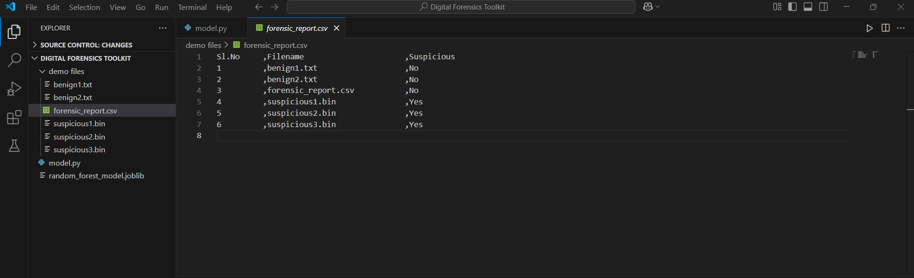
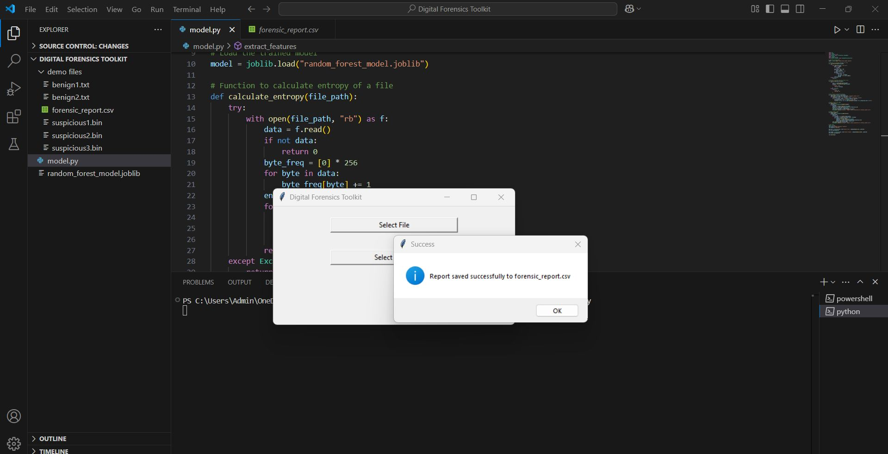
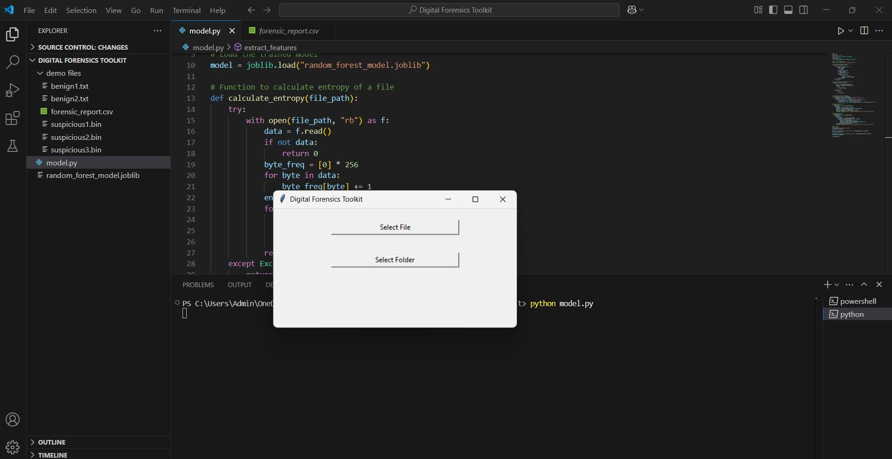

# 🔍 Digital Forensics Toolkit

A lightweight Digital Forensics application that detects suspicious files using **entropy analysis** and a **Random Forest machine learning model**.  
It provides a simple GUI to scan files or entire folders and generates a detailed forensic report in CSV format.

---

## ⚙️ Features

- 🧪 **Entropy-based file analysis**  
  Detects abnormal or malicious binary files by examining byte distribution.

- 🤖 **Machine Learning Classification**  
  Uses a trained Random Forest model (`joblib`) to classify files as  
  **Benign** or **Suspicious**.

- 📁 **Scan Single File or Entire Folder**  
  User can choose a file or a directory for analysis.

- 📄 **Automatic Report Generation**  
  Generates a `forensic_report.csv` containing:
  - File name  
  - Suspicious / Not Suspicious status  
  - Serial number  

- 🖥️ **Simple GUI**  
  Clean interface made with Tkinter for easy usage.

---

## 🏗️ Tech Stack

- **Python**
- **Tkinter** (GUI)
- **Scikit-learn** (Random Forest model)
- **Joblib** (model loading)
- **CSV** (report writing)

---

## 📸 Screenshots

### 🧾 Forensic Report Output  


### 🗂️ Successful Report Generation  


### 🖥️ Toolkit Main UI  


---

## 📂 Project Structure
 Digital Forensics Toolkit/
 │── demo files/
 │ ├── benign1.txt
 │ ├── benign2.txt
 │ ├── suspicious1.bin
 │ ├── suspicious2.bin
 │ ├── suspicious3.bin
 │ └── forensic_report.csv
 │
 │── model.py
 │── random_forest_model.joblib
 │── README.md


---

## 🚀 How to Run

### 1️⃣ Install dependencies
```bash
pip install scikit-learn joblib
# Run the Toolkit
python model.py

# Use the Interface

Click Select File to analyze one file

Click Select Folder to scan all files

Output report will be saved as forensic_report.csv

📘 Explanation

The tool reads each file in binary mode, calculates entropy, extracts features, and uses a pre-trained Random Forest model to classify files as suspicious. The results are stored in a clean CSV report for forensic usage.

📝 Author

Bhargavi Pallaini
Digital Forensics Toolkit (GitHub Project)

⭐ Contribute

Pull requests are welcome!
If you find an issue, feel free to open one on GitHub.
